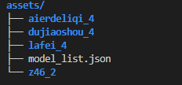
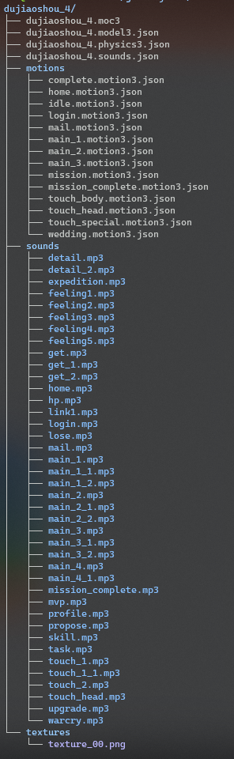
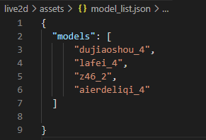
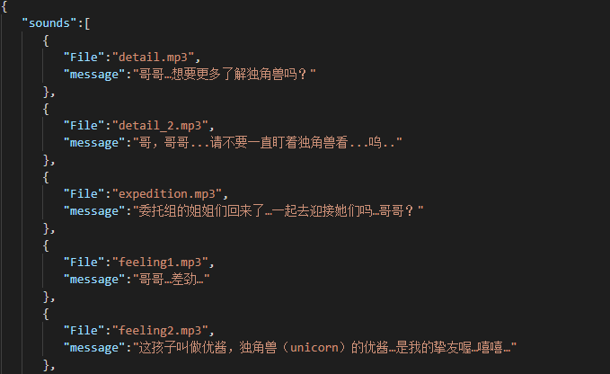

# live2d_waifu_on_web_blhx_ver

## 在网页上引入live2D waifu(blhx特供版)

### 食用须知
本项目为一次新手练习尝试，请勿用于商业用途。 这同时也是我第一个JS Project，存在大量辣鸡代码，请大佬们放过...

### 演示Demo
可在[本人博客](https://darkunicorn.me)左下角查看效果。（注：以下人物模型仅供展示之用，本仓库并不包含任何模型。）

### 使用方法

1.将项目解压并放入web容器或者使用Nginx或Apache等工具反向代理来请求模型资源
 - 推荐使用VS Code Live Server
 
2.可自定义添加blhx模型与音频文件
 - blhx模型默认可放在assets下, 模型与音频来源于途经请自行摸索(笑)
 - 音频文件建议先压缩一遍

3.自行下载Live2d SDKs
- 请自行下载Live2d SDKs并把文件放在 ./live2d/src/lib/里的core和framework中

4.打开网站运行显示
 - 如果出现跨域问题，请最好本地调试

## 模型与音频文件结构

### 模型文件夹结构

### 模型文件结构树

### model_list.json结构样本

### sound.json结构样本

## Work in Progress
- 代码命名注释等不规范问题
- 移除Jquery依赖
- 代码性能&缓存优化
- 模型动作与音频
- 音乐播放器功能?
- CDN

## 项目参考
- [Himehane/live2d_on_website](https://github.com/Himehane/live2d_on_website)
- [stevenjoezhang/live2d-widget](https://github.com/stevenjoezhang/live2d-widget)

## NOTICE (注意，非常重要)

基于 EULA 协议，请勿提交SDKs源代码到仓库里！请勿修改frameworkn与core中的文件！

Baseed on EULA ，DO NOT pull Cubism SDKs on repositorie!DO NOT modify fiels in folder framework !

违反上述规定由此引发的任何法律纠纷，由违反者承担相应责任!

Any legal dispute arising from the violation of the above provisions shall be the responsibility of the violators!

如果你是fork该仓库，也请不要自己放SDK进自己的仓库里，这将违反Live2D公司对于SDK的不可再分发原则

## LICENSE

由于文件基于Live2D 的开源git项目编写，所以以下文件遵循 GNU General Public License, version 2

- [GNU General Public License, version 2](https://www.gnu.org/licenses/old-licenses/gpl-2.0.html)
   - waifu-tips.js
   
Live2D Cubism Core は Live2D Proprietary Software License で提供しています。
 - Live2D Proprietary Software License 
[日本語](http://www.live2d.com/eula/live2d-proprietary-software-license-agreement_jp.html) 
[English](http://www.live2d.com/eula/live2d-proprietary-software-license-agreement_en.html) 
   - live2dcubismcore.min.js

Live2D Cubism Components は Live2D Open Software License で提供しています。
 - Live2D Open Software License 
[日本語](http://www.live2d.com/eula/live2d-open-software-license-agreement_jp.html) 
[English](http://www.live2d.com/eula/live2d-open-software-license-agreement_en.html) 
   - live2dcubismframework.js
   - live2dcubismpixi.js

直近会計年度の売上高が 1000 万円以上の事業者様がご利用になる場合は、SDKリリース(出版許諾)ライセンスに同意していただく必要がございます。 
- [SDKリリース(出版許諾)ライセンス](http://www.live2d.com/ja/products/releaselicense) 

*All business* users must obtain a Publication License. "Business" means an entity  with the annual gross revenue more than ten million (10,000,000) JPY for the most recent fiscal year.
- [SDK Release (Publication) License](http://www.live2d.com/en/products/releaselicense)
